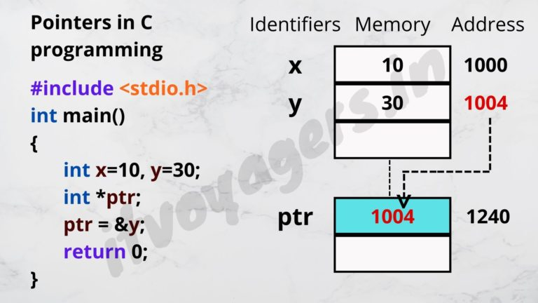
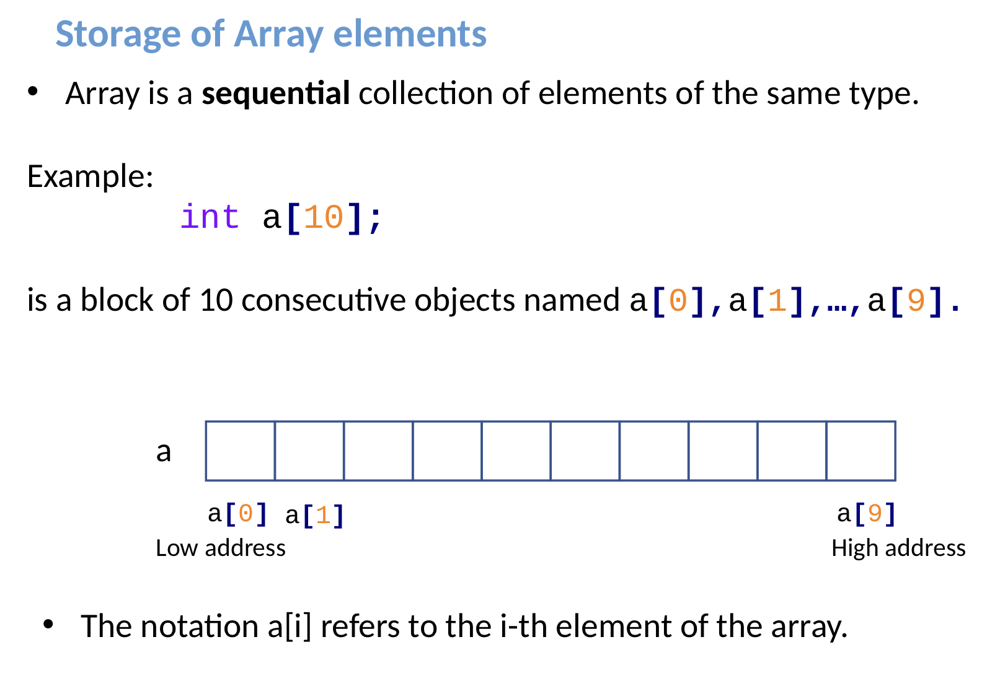
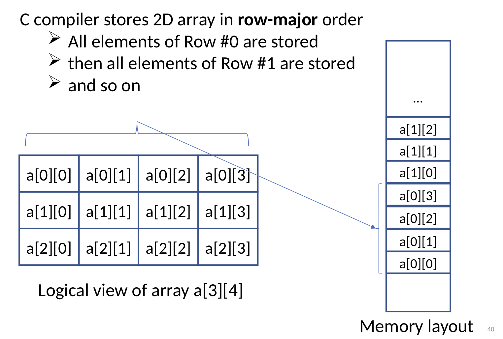
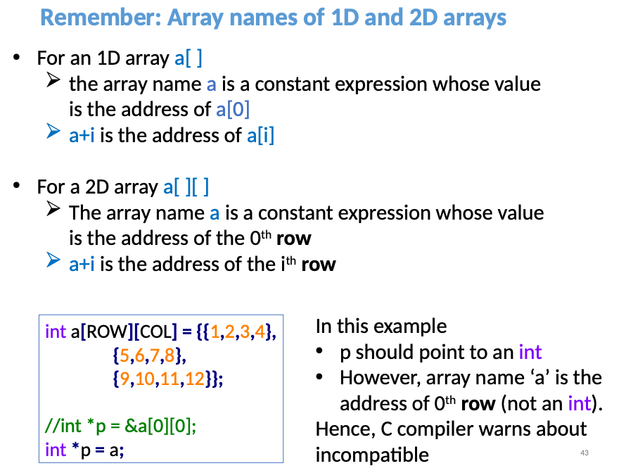

#### Memory Addresses in C

- (&) used to access an address in memory.
- ```int *p = &c``` means p points to c i.e: p stores the memory address of c.
#### Data Types
- Pointer variables take always 8 bytes
```c
printf("Size of int in bytes %d\n", sizeof (int )); // 4 bytes
printf("Size of pointer (int*) in bytes %d \n", sizeof (int *)); // 8 bytes
```
- Similarly...
```c
printf("Size of char in bytes %d\n", sizeof (char )); // 1 byte
printf("Size of pointer (char*) in bytes %d \n", sizeof (char *)); // 8 bytes
```
#### Pointers
- A pointer is a group of cells (usually 2 or 4 cells) that holds an address
- Here, we have declared a pointer ```p``` of ```int``` type.
```c
int* p
```


- A pointer is a variable that contains the memory address of another variable.
- Every variable is stored in a memory location, including pointers

#### Example
- **Dereferencing Operator:** gives the value stored in an address.

- To get the value of the thing pointed by the pointers, we use the ```*``` operator. For example:

```c
int* pc, c;
c = 5;
pc = &c;
printf("%d", *pc);   // Output: 5
```
- Here, the address of ```c``` is assigned to the ```pc``` pointer. To get the value stored in that address, we used ```*pc.```
- In the above example, ```pc``` is a pointer, not ```*pc```.

### Pointer Arithmetic

- Assume we have a pointer p at memory location 1000
- Adding an int (4 bytes) to p -> shifts the pointer location 1004.
```c
const int max = 3;
int var[] = {10, 20, 30 };
int *ptr;
ptr = &var[0];
for (int i = 0; i < 3; ++i) {
    printf("var[%d] is %d \n", i, *ptr);
    ptr++;
}
```
The general form of a pointer variable declaration is:

```c
- int    *ip;    /* pointer to an integer */ 
- double *dp;    /* pointer to a double */ 
- float  *fp;    /* pointer to a float */ 
- char   *ch     /* pointer to a character */
```
### Pointer to Pointer (int **var;)
- A pointer to a pointer is a form of multiple indirection, or a chain of pointers.


- When we define a pointer to a pointer, the first pointer contains the address of the second pointer, which points to the location that contains the actual value as shown below.
#### Example
```c
#include <stdio.h>
int main () {
    int  var;
    int  *ptr;
    int  **pptr;
    var = 3000;
    /* take the address of var */
    ptr = &var;
    /* take the address of ptr using address of operator & */
    pptr = &ptr;
    /* take the value using pptr */
    printf("Value of var = %d\n", var );
    printf("Value available at *ptr = %d\n", *ptr );
    printf("Value available at **pptr = %d\n", **pptr);
    return 0;
}
```
- returns...
```text
Value of var = 3000
Value available at *ptr = 3000
Value available at **pptr = 3000
```
#### Example double pointer vs normal pointer

- Normal pointer example
```c
int main() {
    int *p = (int *)malloc(4 * sizeof(int)); // p is a pointer to an integer (int *).
    // i.e: p stores the first memory address of p[i].
    int *temp = p; // temp actually stores the same memory address as p.

    for(int i = 0; i<4; i++){
        printf("value at temp[%d] is %d", i, *temp);
        temp++;
    }
    return 0;
}
```
- Double pointer example
```c
int main() {
    int arr[3] = {10, 20, 30};  // A simple 1D array with 3 elements
    int *ptr = arr;  // Pointer to the first element of the array

    // Using a double pointer to access array elements
    int **dptr = &ptr;  // dptr stores the memory address of ptr

    // Using a for loop to print the elements via the double pointer
    for (int i = 0; i < 3; i++) {
        printf("Element %d: %d\n", i + 1, *(*dptr + i));  // Dereference the double pointer and access each element
    }

    return 0;
}
```

### Arrays



- Assume we have an array ```int arr[] = {1,2,3}```. Assume we have a pointer ```int *ptr```
```c
ptr = arr is the same as ptr = &arr[0]
```
- If ```p``` points to the first element ```a[0]``` then:
  - ```p+1``` points to ```a[1]```
  - ```p+i``` points to ```a[i]```
  - Hence, ```*(p+i) refers to the content of a[i]```
```c
a[i] = *(p+i)
```
### Computing the ```sum``` of a 1D ```arr```:
```c
int arr[] = {10, 20, 30, 40};
int *p = arr;
int sum = 0;
for (int i =0; i<4; i++){
sum += *(p+i);
}
printf("%d", sum); // sum = 100
```

### 2D Arrays
```c
int matrix[2][3] = { 
        {1, 4, 2}, 
        {3, 6, 8}
};
matrix[0][2] = 2
```

- Logical view of ```int a[3][4]```



#### Accessing 2d Array elements using pointers
- The following code prints the entire 2D ``arr`` in row-major order
```c
#define row = 3
#define column = 4
int a[row][column] = {
        {1,2,3,4},
        {5,6,7,8},
        {9,10,11,12}
};
int *ptr = &a[0][0];
for (int i = 0; i< row*column; i++){
    printf("%d\n", *(ptr+i));
}
```



#### Sum of a 2D Array

```c
#include <stdio.h>
#define ROW 2
#define COL 3

int main () {
    int matrix[2][3] = {
            {1, 4, 2},
            {3, 6, 8}
    };
    int i, j, sum = 0;
    for (i = 0; i < ROW; i++) {
        for (j = 0; j < COL; j++) {
            // sum = sum + *(*(matrix + i) + j);
            sum = sum + matrix[i][j];
        }
    }
    printf("sum is: %d", sum);
}
```
