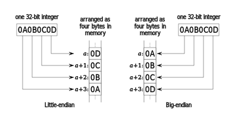

### Endianness

- Endianness is primarily expressed as big-endian (BE) or little-endian (LE).
- A big-endian system stores the most significant byte at the smallest memory address.
- A little-endian system, in contrast, stores the least-significant byte at the smallest address.
- The difference between big- and little-endian is the order of the four bytes of the integer being stored.
  

#### Left and Right Most Bytes

- The leftmost (first) byte is the most significant (contains the most significant eight bits of the corresponding bit string)
- The rightmost (last) byte is the least significant (contains the least significant eight bits of the corresponding bit string).