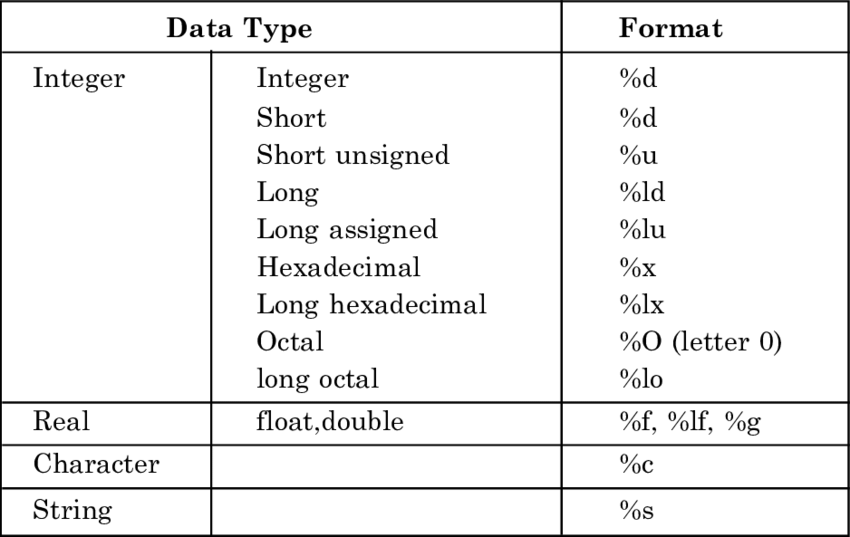

### Prototype: scanf("%format", &var)


- If you have a variable ```var``` in your program, ```&var``` will give you its address in the memory.
- Here, the value entered by the user is stored in the address of ```var``` variable. Let's take a working example.
```c
#include <stdio.h>
int main()
{
  int var = 5;
  printf("var: %d\n", var);

  // Notice the use of & before var
  printf("address of var: %p", &var);  
  return 0;
}
```

#### Output

```
var: 5
address of var: 0x7ff7b018c588
```


