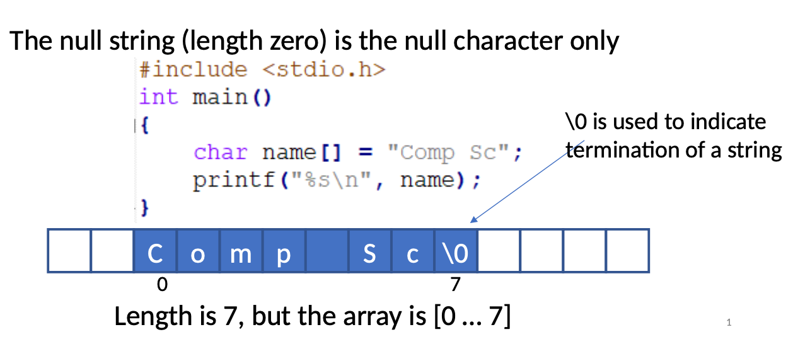

### Strings

- A string of characters is a 1D array of characters
- ASCII code (1 byte) of each character element is stored in consecutive memory locations


- String is terminated by the null character ‘\0’ (ASCII value 0).
- The null string (length zero) is the null character only

### Nice to Know

- A string can be read using ```sscanf```
  -  ```Format conversion``` specifier for a sequence of non-white-space characters is ```%s```.
  - E.g. scanf(“%s”, a) will store only “Comp” for user input “Comp Sc”
- ```%[^\n]``` for strings with white-space included
  - E.g. scanf(“%[^\n]”, a) will store “Comp Sc” for user input “Comp Sc”

### String access using pointers

- How to print a string using pointers:
```c
char name[] = "Comp Sc";
char *ptr = &name[0];
while (*ptr != '\0'){
    printf("%c",*ptr);
    ptr++;
} // returns Comp Sc
```
- This code is equivalent to:
```c
char *ptr = "Comp Sc";
while (*ptr != '\0'){
    printf("%c",*ptr);
    ptr++;
} // returns Comp Sc
```
### Note
- A string gets stored in the 'read-only' section of the program code
```c
char *ptr = "Comp Sc";
*ptr = 'c'; // wrong
while (*ptr != '\0'){
    printf("%c",*ptr);
    ptr++;
} // returns Comp Sc
```
- Any attempt to modify read-only data will cause 'segmentation' fault and the program will crash

### Library string.h

- Library functions are available to manipulate strings.
- A list of commonly used string manipulation functions:

#### ```strcpy()``` - copy a string
```c
#include <stdio.h>
#include <string.h>

char src[40];
char dest[100];
printf ("Enter source string:");
scanf ("%[^\n]", src);
strcpy(dest, src);
printf ("Destination string: %s\n", dest);
```
#### ```strcat(str1, str2)``` - concatenate two strings
```c
char str[100] = "Hello ";
strcat (str, "World!");
printf ("New string: %s\n", str);
}
```
#### ```strlen()``` - get string length
- ```n``` is the length of the str
```c
char str[100];
int n;
printf ("Enter source string: ");
scanf ("%[^\n]", str);
n = strlen(str);
printf ("Length is %d\n", n);
```
#### ```strcmp(str1, str2)``` - compare two strings
- If the strings are equal then returns 0
- Otherwise, returns the numeric difference between the first non matching characters
```c
char str1[100] = "Hello World!";
char str2[100] = "Hello World!";
char str3[100] = "Hello Wosld!";
int n;
n = strcmp(str1, str2);
printf ("Difference is %d\n", n); // returns 0
n = strcmp(str1, str3);
printf ("Difference is %d\n", n); // returns -1
```
### Space issues
- Need to ensure that sufficient memory is allocated at run-time for storing the string and the ```\0``` character
- No checks are done at compile-time or run-time

### Buffer Overflow problems...

- All functions which store user input directly as a string are inherently unsafe as the length of the string is not known, and should not be used. 
- - Examples are: scanf "%s" and gets. Suitable replacements are fgets or getline.
- However... in java
```text
length of strings checked at run time => Buffer overflow impossible.
```
### Examples

```c
char buffy[40]; // includes \0 at the end
fgets(buf, sizeof buf, fp)
```

- Example Copy Source and Destination String

```c
#include <stdio.h>
#include <string.h>

int main(){
  char src[40];
  char dest[100];

  printf("Enter source string: ");
  fgets(src, 40, stdin);
  strcpy(dest, src);

  printf("Destination string: %s", dest);
  return 0;
}