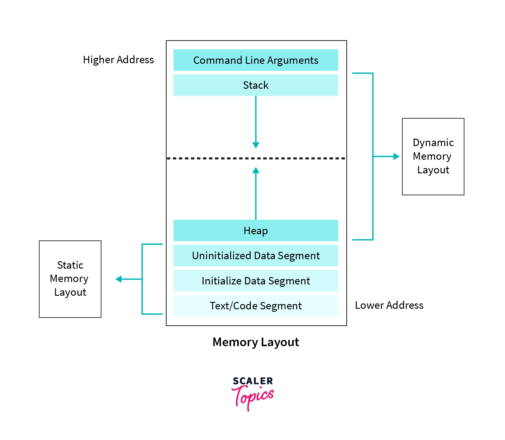

### Memory Management of a C program
- A typical memory layout of a program has the following sections:



#### Text Segment

- After we compile the program, a binary file is generated, which is then used to execute our program by loading it into RAM. 
- This binary file contains executable instructions, and these instructions get stored in the text segment of the memory.
- Text segment has read-only permission that prevents the program from accidental modifications.

### Initialized Data segment

- Initialized data segment or data segment is part of the computer's virtual memory space of a C program that contains values of all external, global, static, and constant variables whose values are initialized at the time of variable declaration in the program.

- We can further classify the data segment into the ```read-write``` and ```read-only areas```.

#### Example
- In this example, ```global_var2``` is declared with the keyword ```const``` and hence it is stored in the read-only part of initialized data segment. 
- Static variables like ```a``` are also stored in this part of the memory.
```c
#include<stdio.h>

int global_var = 50; /* read-write part of initialized data segment*/
char* hello = "Hello World"; /* read-write part of initialized data segment*/

const int global_var2 = 30; /* read-only part of initialized data segment */

int main() {
    static int a = 10;  // static variable stored in initialized data segment
    return 0;
}
```
### Uninitialized data segment

- An uninitialized data segment is also known as ```bss``` (block started by symbol).
- BSS also contains all the ```uninitialized``` static and global variables, initialized with arithmetic 0 and pointers to (null pointer).
- Because values of variables stored in bss can be changed, this data segment has read-write permissions.

#### Example

```c
int global_variable; // Uninitialized global variable stored in the bss segment
int main()
{
    // Uninitialized static variable stored in bss
    static int static_variable;
    
    printf("global_variable = %d\n", global_variable); // returns 0
    printf("static_variable = %d\n", static_variable); // returns 0
    return 0;
}
```
### Static Variables
- They are stored in the data segment, not in the stack.
- The data segment is active during the entire lifetime of a program, which means that:
  - static variables preserve their values even after they are out of scope

#### Example
```c
int foo(int b){
    int a = 0;
    a = a + b;
    printf("a=%d\n", a);
}
int main(){
    foo(1); // returns 1
    foo(1); // returns 1
    return 0;
}
```
- which differs from the code
```c
int foo(int b){
    static int a = 0;
    a = a + b;
    printf("a=%d\n", a);
}
int main(){
    foo(1); // returns 1
    foo(1); // returns 2
    return 0;
}
```
### Stack Segment

- To watch: https://www.youtube.com/watch?v=lVMYUxGGHRM&ab_channel=SandeepKumar

  - scope: part of the program where a variable can be used (or seen)
  - Local variables: Their scope is the function. They are allocated in the stack-frame of the function. After the function call, the stack frame is released (and so does every local variable created in a function).

- The stack segment follows the LIFO (Last In First Out) structure.
- The stack grows in the direction opposite to heap, hence growth is downwards.
- A stack pointer points to the top element of the stack.
- Stack segment stores the value of local variables and values of parameters passed to a function along with some additional information like the instruction's return address, which is to be executed after a function call.

#### Stack Frames and Function calls
- For each function call, a stack frame is created. After the function call, the stack-frame is released
- The stack frame grows from high address to low address
- A stack frame stores
  - return address of caller
  - input parameters
  - local variables
##### Return address
- The ```return addresss``` is defined as the address of next instruction after the function call in the program.
##### Explanation
- The return address is specified in the stack when a program contains a function call or subroutine.
- When the function is called then, after its complete execution it has to return back to the original program 
