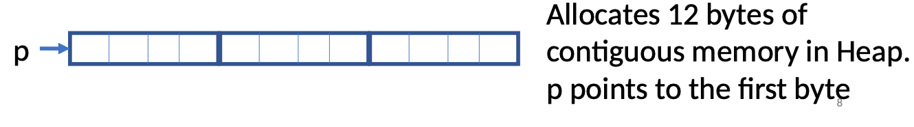

### Dynamic Memory Allocation

- ```Heap Memory``` is used in dynamic memory allocation during run-time
  - allocated explicitly by programmers and it won’t be deallocated until it is explicitly freed.
  - Advantage: optimal memory consumption. Allocating a large array could be wasteful or insufficient
---
### malloc()
#### definition
- ```malloc() ```function reserves blocks of memory (contiguous) of the specified number of bytes from the **Heap**.
- Returns a pointer to the first byte of the allocated space
- If memory allocation fails, ```malloc()``` returns ```NULL``` pointer
---
- Allocating memory for 3 integers
```c
int *p = (int *)malloc(3* sizeof(int));
```

- 3 blocks of 4 bytes each



- p points to the first byte
- The above allocates 12 bytes of contiguous memory in Heap.
- Dynamically allocated block of memory can be released.
  - ```free(p):``` Block of memory pointed by p is released
  - After ```free()```, the block of memory is returned to the Heap 

---
### realloc()

- If the dynamically allocated memory is insufficient or more than required, you can change the size of previously allocated memory using the ```realloc()``` function.
---


### Dynamic Array allocation example
- In C, dynamic arrays are implemented using pointers and memory allocation functions

```c
int main() {
    int n; // size of array
    printf("Provide an array size: ");
    scanf("%d", &n);

    // Allocate memory in heap:
    int *p = (int *) malloc(n*sizeof (int ));
    if (p == NULL){
        printf("Memory allocated fail");
        exit(-1);
    }
    printf("Provide %d elements of array: \n", n);
    for (int i = 0; i < n; ++i) {
        scanf("%d", p+i);
    }

    // Print elements in arr
    int *ptr = p;
    for(int i = 0; i<n; ++i){
        printf("arr[%d] is %d \n", i, *ptr);
        ptr++;
    }
    free(p);
    return 0;
}
```
