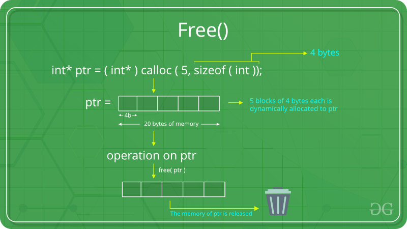
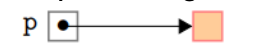
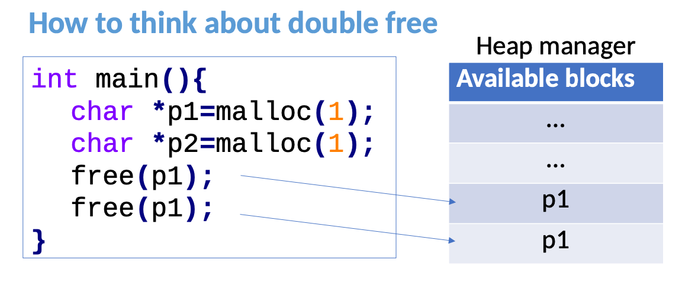

### Free definition
#### definition
- The ```free()``` function in C is used to free or deallocate the dynamically allocated memory.



---
- Do not ```free()``` objects that did not come from ```malloc()```
- Example:
```c
int c[] = {1,2,3};
free(c); // program is aborted
```
- ```gcc```, i.e: the compiler, gives a warning
  - "attempt to free a non-heap object"
---
### Accessing memory after ```free()```
- After ```free(p)```, the memory is no longer owned by the program.



- - Some other program may be using the memory!
- - Re-acessing the memory pointed by p causes undefined behaviour, crashes or data corruption
- - To avoid issues: always set pointers to NULL or another valid value after freeing them.
- - Valgrind reports memory error

```c
#include <stdio.h>
#include <stdlib.h>

int main() {
    int *ptr = (int *)malloc(sizeof(int));

    // Access allocated memory
    *ptr = 42;
    printf("Value: %d\n", *ptr);

    // Free the memory
    free(ptr);

    // Accessing freed memory (undefined behavior)
    printf("Value after free: %d\n", *ptr);

    return 0;
}
```

---
### Double free problem

- The "double free" problem occurs when you attempt to free the same block of memory more than once.
    - This situation leads to undefined behavior and can cause crashes or other unpredictable outcomes.
- Example:
```c
char *p1=malloc(1); 
free(p1);
free(p1); // program is aborted
```
#### Thinking about the double-free problem


- When you allocate memory on the heap using functions like ```malloc``` or ```calloc```, the heap manager keeps track of the allocated blocks.
- Every time ```free()``` is called, the address of the pointer is added in the list of available memory blocks
- Since ```p1``` is present twice in the list:
    - Subsequent allocations may reuse an unused buffer block,
    - which could allow an attacker to write arbitrary values in memory and executing code of their choosing
- Consequences: data corruption, crash or unexpected behaviour