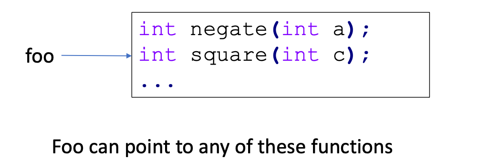
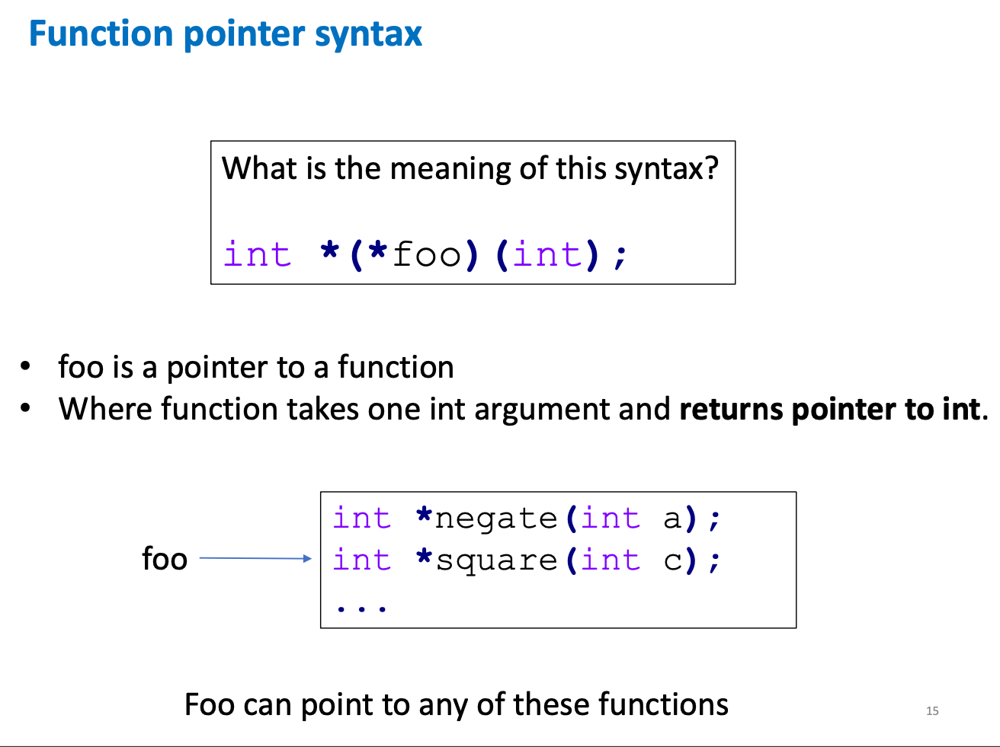

### Function pointers
- Functions have a memory address
- Function pointers in C are variables that can store the memory address of functions

#### Example

```c
#include <stdio.h>

int add(int a, int b){
    return a +b;
}


int main(){
    int (*operation)(int, int); // Function pointer
    operation = &add; // operation = add;
    int result = operation(5,3);
    printf("Result of add: %d\n", result);
    
    return 0;
}
```


### Another way of thinking...

- foo is a pointer to a function, where this function takes one int argument and returns int
```c
int (*foo)(int);
```



### Tricky Case




