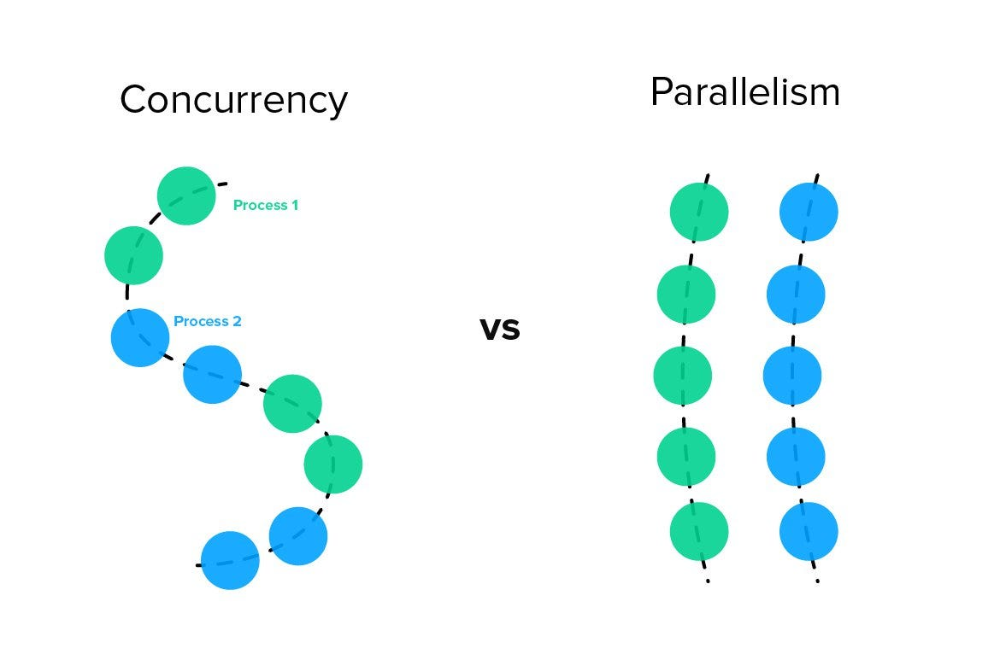
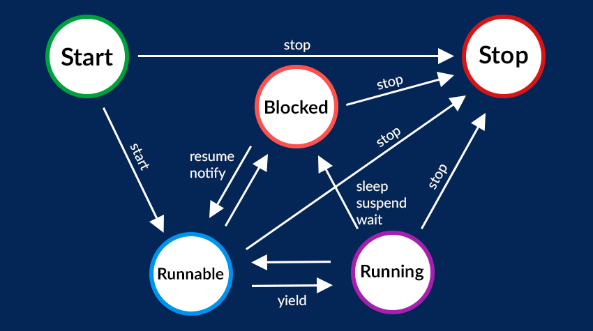
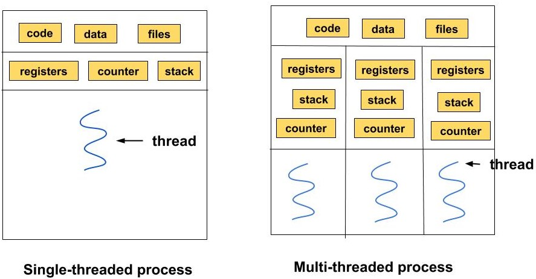

### Synchronous vs. Asynchronous Programming

### Synchronous Programming
- In a synchronous program, tasks are executed one after the other, and each task must complete before the next one begins. 
- This can lead to blocking, where the program waits for a task to finish before moving on to the next.
- The order of execution is typically deterministic and follows the sequence of statements in the code.

### Asynchronous Programming

- Asynchronous programming involves concurrency. 
- While one process is waiting for something (e.g., I/O operation or network request), the program can continue executing other processes.
- The order of execution may become non-deterministic due to concurrent operations.
### Concurrent Programming

- Concurrent: operating or occurring at the same time.
- Concurrency can be achieved through threading.

### Parallelism

- Is the execution of multiple tasks/processes at the same time. This can occur through various means such as multi-core processors.
  - Parallel tasks are always concurrent.
  - Concurrent tasks are not necessarily parallel

### Threading

- Threading is a programming technique where a process is split into multiple threads, and each thread runs independently within the same process.
- A thread of execution is the smallest sequence of programmed instructions that can be managed independently by a scheduler.
  - Threads share resources/data: 
    - Text/Code and data segments, and the Heap.  
      - This allows them to access the same variables.
    - Other resources such as opened files, sockets, etc.
---
- A thread consists of:
  - thread ID: Each thread is identified by a unique thread identifier (TID).
  - Program Counter (PC): The program counter keeps track of the address of the next instruction to be executed by the thread.
  - Their own stack: used for storing local variables, input parameters, and return addresses.
---
### Thread States

- New: The thread has been instantiated but not yet scheduled for execution. 
- Runnable: The thread is ready to run and waiting for the scheduler to allocate CPU time. 
- Blocked: Thread is temporarily inactive or waiting for an event to occur. 
  - This could be due to waiting for I/O, acquiring a lock, or a specified sleep duration.
- Running: The thread is actively executing its instructions in the "Running" state. 
- Terminated/Dead: The thread has completed its execution. 
### Single vs Multithreading

- In single-threaded programming, there is only one thread of execution. The execution of code occurs sequentially.
- In a multithreaded program, multiple threads run concurrently.

