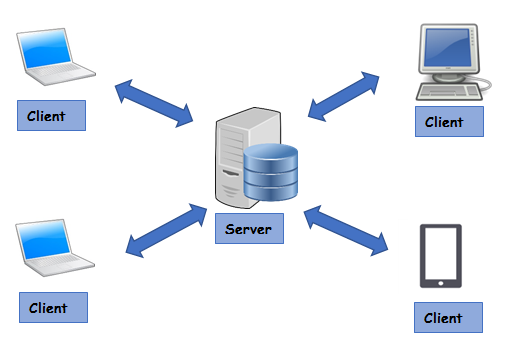
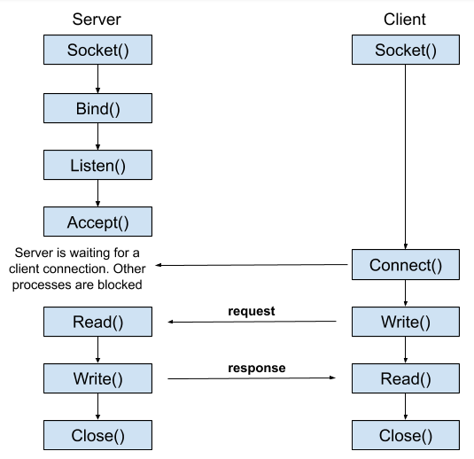
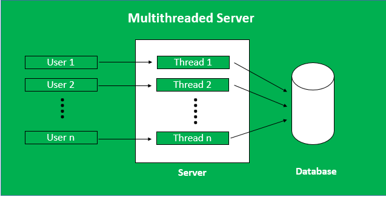

### Client Server Architecture

- Client-server architecture is a type of computer network where multiple clients can connect and request services from a centralized server.
    - The server provides services, resources, or data to clients.
  

### Socket Programming

- A socket is one endpoint of a two-way communication link between two programs running on the network.
  - Socket: IP Address + Port
  - Port: numbers which identify endpoints of a connection
  - Every TCP connection can be uniquely identified by its two endpoints.

Socket programming is a way of connecting two nodes on a network to communicate with each other.
- One socket listens on a particular port at an IP, while the other socket reaches out to the other to form a connection (usually via TCP/IP).

- bind() is used to associate a socket with a specific local address and port.
---
### Sequential Servers

- In a sequential server, tasks or requests are processed one at a time, sequentially.
- Each request must be completed before moving on to the next one.
- This approach is straightforward and easy to reason about.

Drawback:  If a request takes a long time to process, subsequent requests have to wait.
### Multi-Threaded Servers

- A server having more than one thread is known as Multi-Threaded Server.
- It creates one thread to attend each client and handle each individual request

Drawback: Improper synchronization can lead to deadlocks, where threads are blocked waiting for each other, causing the system to come to a halt.

