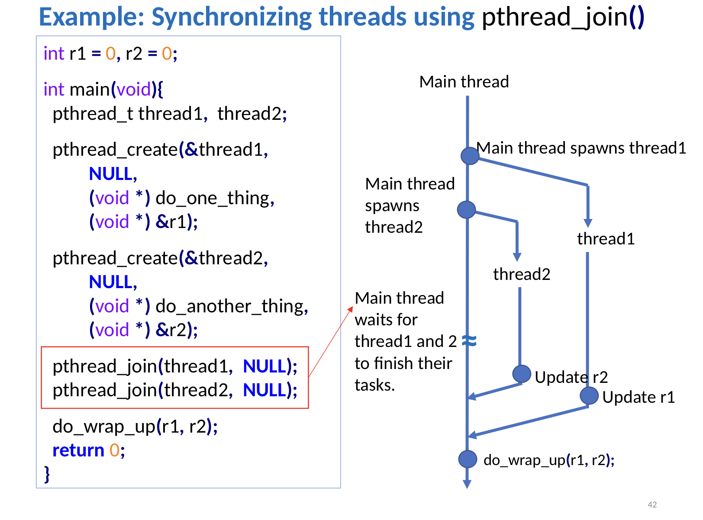
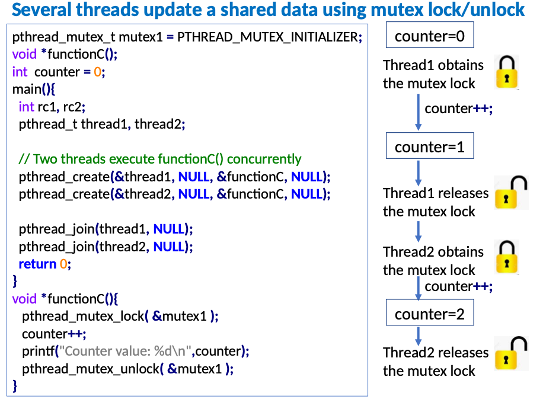

### Thread Synchronization

- Thread synchronization refers to coordinating threads to work in unison
  - It can be used to enforce some order in the execution of code
- This is a crucial to ensure that multiple threads in a program can safely access shared resources without resulting in data corruption or unexpected behavior.
---
- ```Pthreads``` library provides three synchronization mechanisms:
  - Joins
  - Mutexes (Mutual exclusion)
  - Condition variables

---

#### ```pthread_join()```



- It allows one thread to wait until another thread completes its execution.
- It is a blocking function. The syntax is:

```c
int pthread_join(pthread_t thread_id, NULL);
```
- ```thread_id```: The identifier of the thread you want to wait for.

---

### Mutexes

- A race condition often occurs when two or more threads try to access and modify shared data concurrently.
  - but the results of computations depend on the order in which these operations are performed.
- Race conditions can be solved if we can enforce ```mutual exclusion```
  - where threads get exclusive access to the shared resource in turn

- Mutexes: are used to serialize access to shared resources.

- ```pthread_mutex_lock``` blocks the calling thread until the mutex becomes available

---

- Initialization of a mutex object:

```c
// Mutex for protecting sharedData
pthread_mutex_t mutex = PTHREAD_MUTEX_INITIALIZER;
```
- The following shows the use of mutex for serializing access to a shared resource.
  - Threads access ```counter``` serially one after another.
```c
pthread_mutex_lock(&mutex); 
counter++;
pthread_mutex_unlock(&mutex);
```

### Example Program



- Several threads update shared data using mutex lock/unlock

```c
pthread_mutex_t mutex1 = PTHREAD_MUTEX_INITIALIZER;

int counter = 0;

void *functionC(){
    pthread_mutex_lock( &mutex1 );
    counter++;
    printf("Counter value: %d\n",counter);
    pthread_mutex_unlock( &mutex1 );
}


int main(){
    pthread_t thread1, thread2;

    // Two threads execute functionC() concurrently
    pthread_create(&thread1, NULL, &functionC, NULL);
    pthread_create(&thread2, NULL, &functionC, NULL);

    // Wait for threads to finish
    pthread_join(thread1, NULL);
    pthread_join(thread2, NULL);
    
    return 0;
}
```
### Critical Regions (code where shared resources are accessed)

- The code segment that resides between ```mutex_lock()``` and ```mutex_unlock()```.
- Critical region is executed serially by the threads.
- The goal of defining critical regions is to ensure that only one thread at a time can execute the critical section, preventing concurrent access to shared data and maintaining data consistency.

#### Mutual exclusion Pitfalls and Deadlocks

- A deadlock is a situation where two or more threads cannot proceed because each is waiting for the other to release a lock, leading to a circular waiting condition.
---
- Here's an example of a potential deadlock scenario when thread1 and thread2 run concurrently:

  - thread1 obtains mutex1.
  - thread2 obtains mutex2.
  - thread1 attempts to obtain mutex2 but gets blocked since it's already held by thread2.
  - thread2 attempts to obtain mutex1 but gets blocked since it's already held by thread1.

```c
pthread_mutex_t mutex1 = PTHREAD_MUTEX_INITIALIZER;
pthread_mutex_t mutex2 = PTHREAD_MUTEX_INITIALIZER;
```
---
```c
void *thread1() {
    pthread_mutex_lock(&mutex1);  // Acquire mutex1
    pthread_mutex_lock(&mutex2);  // Acquire mutex2 (Possible deadlock point)

    // Critical section (code where shared resources are accessed)

    pthread_mutex_unlock(&mutex2);  // Release mutex2
    pthread_mutex_unlock(&mutex1);  // Release mutex1

    pthread_exit(NULL);
}
```
---
```c
void *thread2() {
    pthread_mutex_lock(&mutex2);  // Acquire mutex2
    pthread_mutex_lock(&mutex1);  // Acquire mutex1 (Possible deadlock point)

    // Critical section (code where shared resources are accessed)

    pthread_mutex_unlock(&mutex1);  // Release mutex1
    pthread_mutex_unlock(&mutex2);  // Release mutex2

    pthread_exit(NULL);
}
```
### Avoiding deadlocks

- The ```pthread_mutex_trylock``` is used to attempt to lock a mutex without blocking. 

```c
int pthread_mutex_trylock(pthread_mutex_t *mutex);
```

- If the mutex is successfully locked by the calling thread, ```pthread_mutex_trylock``` returns 0.
- If the mutex is already locked by another thread, it returns ```EBUSY``` (Resource busy).