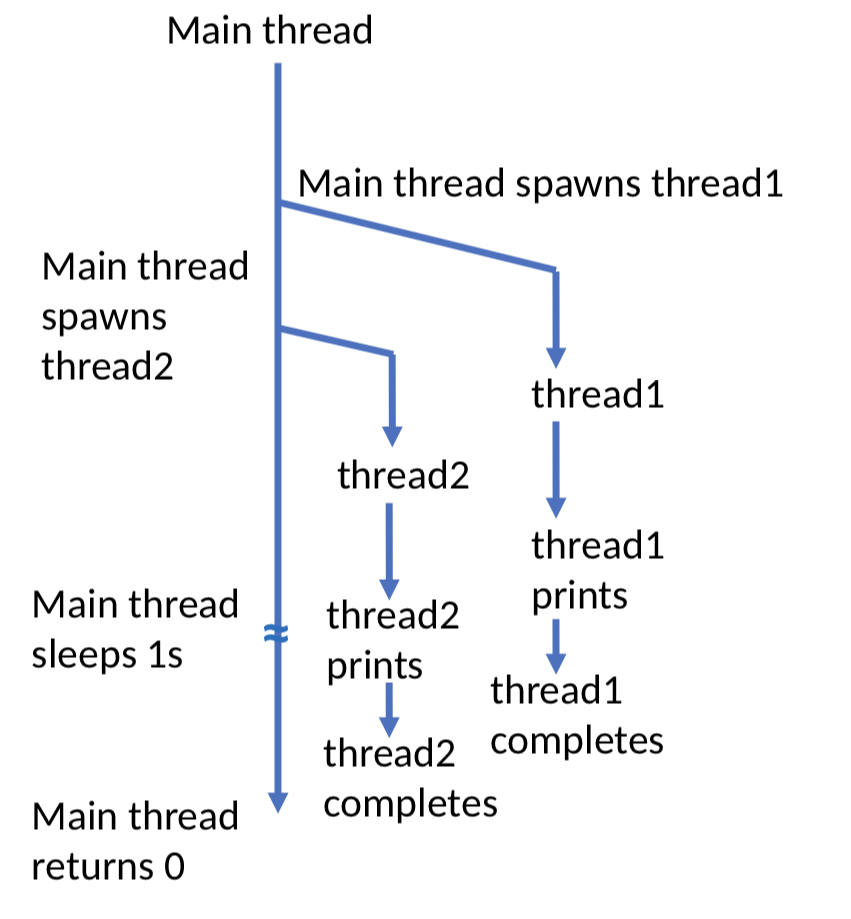
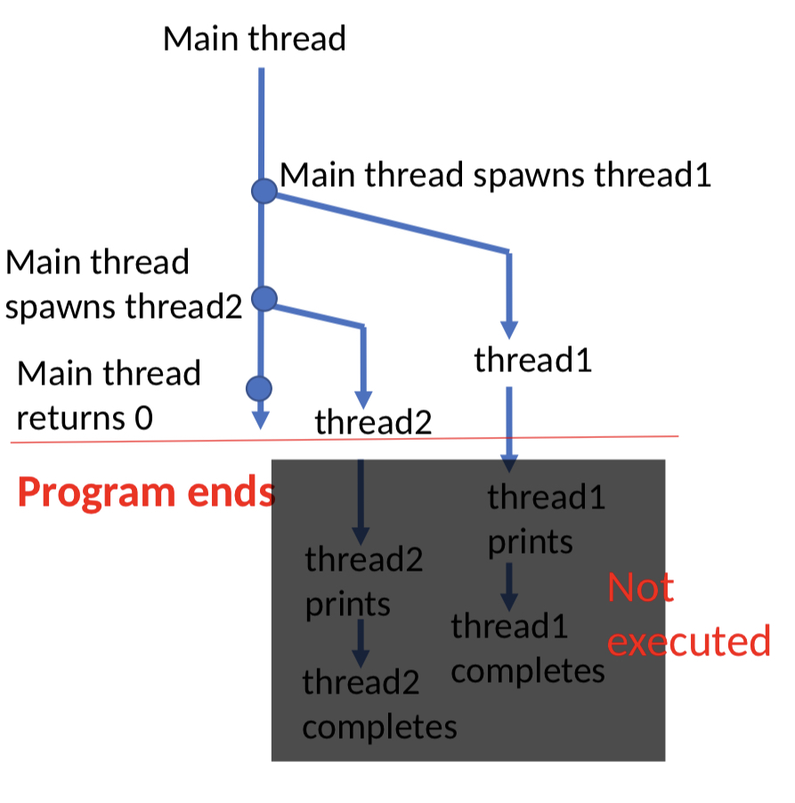

### Threading ```pthreads```

- In C programming, pthreads (POSIX threads) refers to a standard thread library that provides a set of functions and data types for creating and manipulating threads.
- In your C program, you need to include:

```c
#include <pthread.h>
```
- When linking, you must link to the ```pthread``` library using compilation flag ```-lpthread```. Example: ```gcc -lpthread file.c```.

### Creating a pthread 

- A thread is created using ```pthread_create()```
- The syntax is:

```c
int pthread_create(
    pthread_t *thread_id, // ID number for thread
    NULL, // default thread attributes
    void *(*function)(void *), // function to be executed 
    void *arg // argument of function
);
```

- ```pthread_create()``` returns 0 if thread creation is successful 
- Otherwise it returns a nonzero value to indicate an error.

### Program Flow Example
```c
int main(void){
    
    pthread_t thread1, thread2;
    
    // Thread Creation Thread1
    pthread_create(&thread1, NULL, (void *)do_one_thing, NULL);
    
    // Thread Creation Thread2
    pthread_create(&thread2, NULL, (void *)do_another_thing, NULL);
    
    sleep(1); // sleeps 1s
    return 0;
}
```


- Initially, only the main thread is present
- Main thread spawns thread1
- Main thread spawns thread2
- It might happen that thread1 has started printing
- While main thread goes for a sleep of 1s, the other two threads continue with printing and finally completes.
- Finally the main thread finishes and returns 0.

### Program Flow Example II
- In this program, ```sleep(1)``` is commented out.
- This program does not print anything!
```c
int main(void){
    
    pthread_t thread1, thread2;
    
    // Thread Creation Thread1
    pthread_create(&thread1, NULL, (void *)do_one_thing, NULL);
    
    // Thread Creation Thread2
    pthread_create(&thread2, NULL, (void *)do_another_thing, NULL);
    
    // sleep(1); // sleeps 1s
    return 0;
}
```
